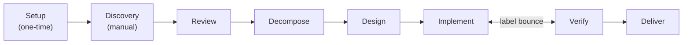
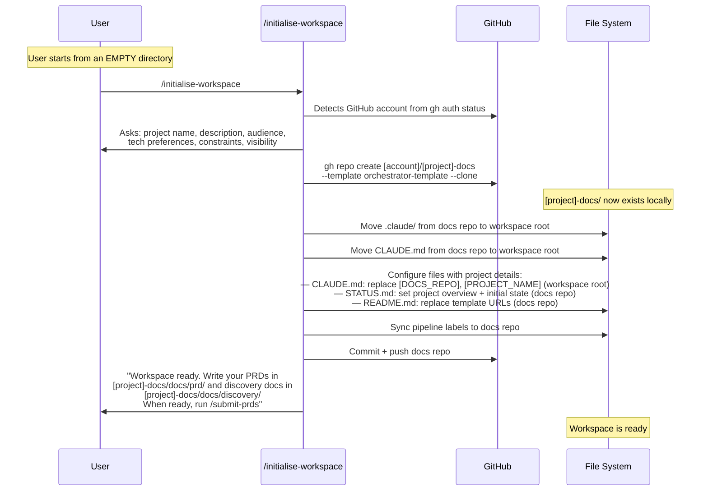
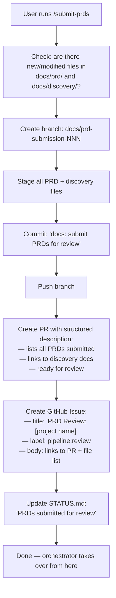
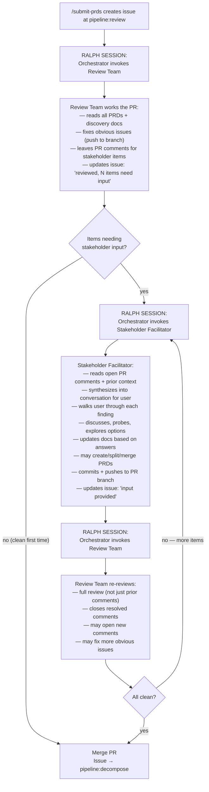
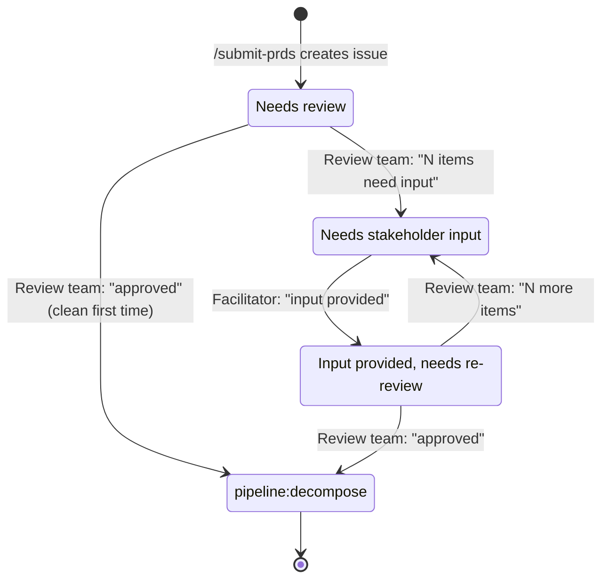
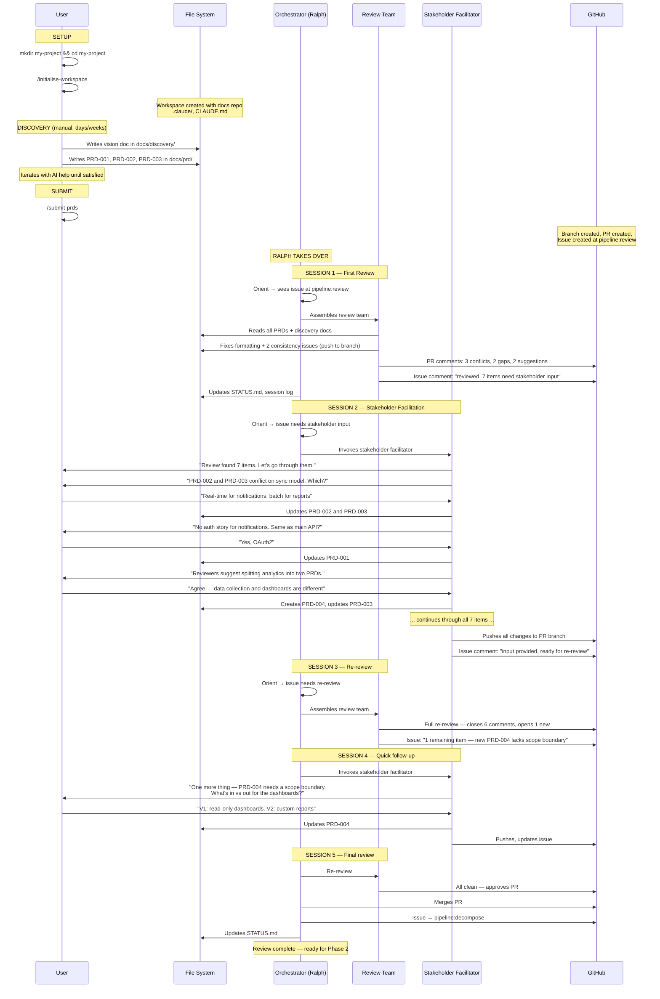

# Pipeline Redesign v2

> Phase-by-phase design. Nailing each phase before moving on.
> Currently focused on: **Setup + Phase 0 + Phase 1**
> Goal: get these solid enough to test in Claude before proceeding.

---

## High-Level Pipeline (for reference)



**Currently designing:** Setup → Discovery → Review.

---

## Setup: Workspace Initialisation

One-time. Creates the workspace and docs repo from the orchestrator
template. Already drafted as `/initialise-workspace` (global skill)
and `/adapt-project`. These could be one skill — the split is an
implementation detail.

### What the skill asks

Quick setup questions — enough to seed the project with useful context
without dragging the process on.

| Question | Why | Notes |
|----------|-----|-------|
| Project name / codename | Names the docs repo, used everywhere | e.g. "northwind", "acme" |
| High-level description | Seeds STATUS.md, CLAUDE.md, gives agents context | One paragraph — what are you building? |
| Target users / audience | Helps review agents understand "who is this for" | Brief — personas come later in PRDs |
| Known tech preferences | Informs later architecture decisions | Optional — ".NET APIs, Angular UI" etc. |
| Known constraints | Timeline, compliance, existing systems to integrate | Optional — whatever is known now |
| Repo visibility | Public or private | Default: private |

**GitHub account** is detected from `gh auth status` — not asked.

### What happens



### What the workspace looks like after setup

```
workspace/                        ← user started here
├── .claude/                      ← MOVED from docs repo (tooling, static)
│   ├── agents/                   ← specialist agent definitions
│   ├── skills/                   ← pipeline skills
│   ├── hooks/                    ← session hooks
│   └── rules/                    ← conventions
├── CLAUDE.md                     ← MOVED from docs repo (operating manual, static)
└── [project]-docs/               ← docs repo (git repo — ALL project state lives here)
    ├── STATUS.md                 ← project state (current sprint, blockers, progress)
    ├── repos.yaml                ← repo registry (docs repo only for now)
    ├── active-work/              ← session logs per epic
    ├── docs/
    │   ├── discovery/            ← vision + supporting materials
    │   ├── prd/                  ← PRD documents
    │   ├── architecture/         ← system designs + ADRs (later)
    │   ├── design/               ← UX + impl design (later)
    │   ├── planning/             ← roadmap + epic briefs (later)
    │   └── conventions/          ← shared standards
    ├── templates/                ← issue + PR templates
    └── scripts/                  ← ralph.sh, setup helpers
```

**Why move, not copy?** `.claude/` and `CLAUDE.md` are tooling — they
define how Claude operates. They come from the orchestrator template,
get configured once, and don't change. No duplication, no confusion
about source of truth.

**No AGENTS.md.** Claude Code doesn't natively support the AGENTS.md
open standard. Sub-agents get their instructions from
`.claude/agents/*.md` files, not AGENTS.md. Project memory is handled
through two layers:

- **Project state (shared):** STATUS.md, session logs, docs — git-tracked
  in the docs repo. This is the source of truth.
- **Auto memory (local):** Claude's native `~/.claude/projects/<project>/memory/`
  — machine-local, Claude manages it automatically. Useful but not
  shared. Important learnings should be promoted to CLAUDE.md or
  `docs/conventions/`.

**The docs repo is the project's shared brain.** All project state,
documentation, session history, and cross-agent context lives here.
Agents read it to understand where things are. Agents write to it so
future sessions inherit their knowledge.

No component repos yet — those are created by `/repo-provision` during
the Design phase, after architecture identifies what's needed.

### What the user needs to know

- Run from an empty directory
- Have `gh` CLI authenticated (account is auto-detected)
- Know their project name and a one-paragraph description
- Everything else is asked or handled by the skill

### Key point: global skill

`/initialise-workspace` must be installed globally at
`~/.claude/skills/initialise-workspace/SKILL.md` so it's available
before any project workspace exists. All other skills live in `.claude/`
which doesn't exist until init runs.

---

## Phase 0: Discovery (Manual)

User writes PRDs and vision docs in the IDE with AI help. This is
creative, iterative, potentially days of work. The user is shaping
their product vision — what they're building, why, for whom.

### What goes where

The user needs to know two locations:

| What to write | Where to put it |
|---------------|-----------------|
| Product vision, high-level overview, context, research, competitor notes, user research | `[project]-docs/docs/discovery/` |
| Detailed requirements documents (PRDs) | `[project]-docs/docs/prd/` |

**PRDs** are loosely defined. They don't need to follow a rigid template.
They need enough detail to review and decompose. Could be 1 doc or 20.

**Discovery docs** are supporting materials — vision statement, user
personas, market context, constraints, anything that gives context to
the PRDs.

### What the user does

1. Works in the IDE with AI assistance to write PRDs
2. Iterates as much as needed — this is exploratory
3. Puts files in the right folders
4. When ready to enter the pipeline: runs `/submit-prds`

### What `/submit-prds` does

This is the bridge from manual discovery into the orchestrated pipeline.
The user runs it once to submit their initial PRDs. It handles all the
git/GitHub mechanics.



**Re-runnable:** If the user adds more PRDs later (e.g., after review
feedback suggests a new PRD is needed), they can drop new files and run
`/submit-prds` again. It handles the branch/PR mechanics each time.

---

## Terminology: User Engagement Types

Different phases need different types of user interaction. They're not
all the same thing. Naming them properly avoids confusion.

| Type | When | Depth | Agent | Example |
|------|------|-------|-------|---------|
| **Setup** | Workspace init | Light — gather basics, done in minutes | Part of `/initialise-workspace` skill | "What's the project name?" |
| **Facilitation** | PRD review cycle | Deep — reads review context, prior cycles, probes dynamically, makes doc changes | **Stakeholder Facilitator** | "Reviewers found a conflict between PRD-002 and PRD-003. Let's discuss..." |
| **Escalation** | Mid-pipeline | Targeted — specific question, quick answer | **Escalation Agent** (later) | "Design team needs to know: should the API be REST or GraphQL?" |

The **Stakeholder Facilitator** is the main one for Phase 1. It's not
just "asking questions" — it reads the review output, understands
context from prior review cycles, synthesizes findings into a coherent
conversation, makes doc changes in real-time, and pushes everything.

---

## Phase 1: Review Loop

This is where the orchestrator takes over. The review loop has three
actors and cycles between them until the PRDs are clean.

### The three actors

| Actor | Job | When |
|-------|-----|------|
| **Review Team** | Analyse PRDs holistically. Leave PR comments for gaps, conflicts, questions. Fix obvious issues directly. | Autonomous (Ralph session) |
| **Stakeholder Facilitator** | Read review comments + prior context. Walk user through findings. Discuss. Make doc changes based on answers. Push to PR. | Interactive (Ralph session, user engaged) |
| **User** | Answer questions, discuss, make product decisions. | Guided by the facilitator |

### The cycle



### How the orchestrator decides what to do

The issue stays at `pipeline:review` throughout. The orchestrator reads
the issue comments to understand the sub-state:



| Orchestrator reads | Dispatches | What happens |
|---|---|---|
| Issue just created, no review yet | Review Team | First review of PRDs |
| "reviewed, N items need stakeholder input" | Stakeholder Facilitator | Guided conversation with user |
| "stakeholder input provided, ready for re-review" | Review Team | Full re-review of updated PR |
| PR approved | (self) | Merge PR, advance issue to pipeline:decompose |

### What the Stakeholder Facilitator does (detail)

The facilitator is the user's interface to the review process. It does
NOT just dump review comments at the user. It:

1. **Reads all open PR review comments** — understands the full picture
2. **Groups and prioritizes** — "there are 3 conflicts, 2 gaps, and
   3 suggestions. Let's start with the conflicts."
3. **Asks clear questions** — translates technical review language into
   stakeholder questions. "The reviewers noticed PRD-002 describes
   real-time sync but PRD-003 assumes batch. Which is your intent?"
4. **Discusses** — if the user is unsure, the agent can explain
   trade-offs, suggest options, probe deeper
5. **Makes changes** — based on user answers, the agent edits the PRD
   files directly. Creates new PRDs if needed. Splits or merges existing
   ones if that's what makes sense.
6. **Pushes everything** — commits all changes to the PR branch and
   pushes. Updates the issue comment.

The user never touches git, PRs, or issues. They just answer questions.

### What the review team does (detail)

The review team are specialist agents (product + technical) who analyse
the PRDs holistically — across ALL documents, not per-document. They:

1. **Read everything** — all PRDs, vision docs, discovery materials
2. **Product review** — completeness, consistency, gaps, scope clarity,
   success criteria, user stories
3. **Technical review** — feasibility, dependencies, implicit
   complexity, integration points, data concerns, scale implications
4. **Fix obvious issues** — formatting, consistency, gaps they can fill
   from context. Push fixes directly to the PR branch.
5. **Leave PR comments** — for things that need stakeholder input.
   Specific, actionable, with suggestions where possible.
6. **Update the issue** — "reviewed, N items need stakeholder input"
   with a summary of what's outstanding.

On re-review:
- Full review, not just checking prior comments
- Close comments that have been properly addressed
- May open new comments based on changes made
- May fix additional obvious issues

### What this phase produces

| Output | Location |
|--------|----------|
| Reviewed, consistent, complete PRDs | `docs/prd/` (merged PR) |
| Vision + supporting docs | `docs/discovery/` (merged PR) |
| Review history | PR comments (closed/resolved) |
| Issue ready for decompose | GitHub Issue at `pipeline:decompose` |

---

## End-to-End: Setup Through Review

Full walkthrough from empty directory to reviewed PRDs.



---

## Notes for Later Phases

> Rough notes. Each phase gets detailed treatment when we get to it.

### Phase 2: Decompose
- Agent reads reviewed PRDs → produces epics + roadmap
- Creates epic issues at `pipeline:design`
- Initiatives = grouping labels
- PR + review gate

### Phase 3: Design (per epic)
- Orchestrator assesses epic → assembles team → sub-agents produce design
- Decomposes epic into tasks → task issues at `pipeline:implement`
- PR + review gate

### Phase 4: Implement (per task)
- Engineer codes + creates PR → issue → `pipeline:verify`

### Phase 5: Verify (per task)
- Review team works PR → approve or bounce back to `pipeline:implement`
- Label bounce until clean

### Phase 6: Deliver (per epic)
- All tasks done → E2E → docs → release

### Cross-cutting
- Orchestrator loop: orient → decide → work → update (Ralph)
- Issues are the only driver
- PRs are the mechanism
- Label bouncing for review cycles
- File system = shared state
- Backward transitions when downstream finds problems

---

## Decisions Made

| Decision | Why |
|----------|-----|
| `/initialise-workspace` is a global skill | Must exist before project workspace |
| `/adapt-project` runs during init | Configure once, don't repeat |
| Move `.claude/` + `CLAUDE.md`, don't copy | Tooling is static — no duplication, no source-of-truth confusion |
| No AGENTS.md | Claude Code doesn't support it natively. Sub-agents use `.claude/agents/*.md` |
| Auto memory is machine-local (accepted for V1) | Claude's native memory system. Important learnings promoted to shared state |
| Docs repo is the shared brain | All project state, cross-agent context, session logs |
| No component repos at init time | Created during Design after architecture |
| Discovery is manual in IDE | Creative, iterative, human judgment |
| User drops files into specific folders | `docs/prd/` and `docs/discovery/` |
| `/submit-prds` handles all mechanics | User doesn't touch git, PRs, issues |
| `/submit-prds` is re-runnable | Can add/update PRDs later |
| Review Team ≠ Stakeholder Facilitator | Analysis vs. guided conversation — different skills |
| Facilitator walks user through findings | User discusses and decides, facilitator does mechanics |
| Review Team fixes obvious issues directly | Only escalate genuine stakeholder decisions |
| Issue comments track sub-state | Orchestrator reads latest to decide next action |
| PR comments are the tangible feedback | Close as resolved, shows progress |
| One issue through the whole review cycle | No proliferation |
| GitHub account auto-detected | `gh auth status` — don't ask the user |
| Init asks enriching questions (description, audience, constraints) | Seeds every file with useful context from day one |
| "Facilitator" not "Interviewer" for PRD review engagement | Facilitator mediates, synthesizes, acts — different from light setup Q&A |
| Different user engagement types get different names | Setup ≠ Facilitation ≠ Escalation — avoids ambiguity as pipeline grows |

---

## Open Questions

| # | Question | Context |
|---|----------|---------|
| 1 | Should init and adapt be one skill or two? | Currently drafted as separate — may simplify to one |
| 2 | What makes a PRD "good enough" for initial submission? | User needs some guidance without imposing a rigid template |
| 3 | How does the facilitator handle a user who disagrees with all review findings? | Edge case — need a graceful "override" path |
| 4 | What happens if review cycles exceed N iterations? | Need a circuit breaker — maybe escalate to human judgment |
| 5 | Later phases will need more engagement types — what do we call design review facilitation? | May be same Stakeholder Facilitator with different context, or may warrant a new type |
| 6 | Should `/submit-prds` create one issue per submission or reuse existing? | First run = create. Re-run after facilitator adds PRDs = same issue? new? |
| 7 | What if `gh auth status` fails at init? | Need to fail fast with clear guidance |
| 8 | What if workspace directory isn't empty? | Guard? Overwrite? Bail? |
| 9 | Re-running `/initialise-workspace` — idempotent or error? | Accidental re-run, or trying to reset |
| 10 | Where does the orchestrator template live on GitHub? | Needs a known, stable location for `--template` |
| 11 | What does `repos.yaml` look like after init? | Template placeholder? Auto-populated with docs repo entry? |
| 12 | Auto memory promotion mechanism — how and when? | V1: manual or orchestrator promotes. V2: might need sync to docs repo |
| 13 | Do sub-agents need shared project context beyond their agent file? | Orchestrator passes context when spawning — is that sufficient? |
