# Pipeline Redesign v2

> Phase-by-phase design. Nailing each phase before moving on.
> Currently focused on: **Setup + Phase 0 + Phase 1 + Phase 2 + Phase 3 + Phase 4**
> Goal: get these solid enough to test in Claude before proceeding.
>
> **Implementation status:**
> - Setup (`/initialise-workspace`): BUILT
> - Phase 0 (Discovery — manual): BUILT (user writes PRDs + `/submit-prds`)
> - Phase 1 (Review Loop): BUILT (review team + stakeholder facilitator + ralph.sh)
> - Phase 2 (Decompose): BUILT (coordinator + PM + architect team, unified orchestrator)
> - Phase 3 (Design): DESIGNED (research doc detailed, not yet built)
> - Phase 4 (Implement): DESIGNED (research doc detailed, not yet built)
> - Phase 5 (Deliver): ROUGH NOTES ONLY

---

## High-Level Pipeline (for reference)

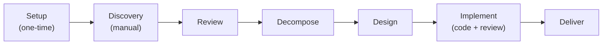

**Currently designing:** Setup → Discovery → Review → Decompose → Design → Implement (all detailed above).

---

## Setup: Workspace Initialisation

One-time. Creates the workspace and docs repo from the orchestrator
template. Already drafted as `/initialise-workspace` (global skill)
and `/adapt-project`. These could be one skill — the split is an
implementation detail.

### What the skill asks

Quick setup questions — enough to seed the project with useful context
without dragging the process on.

| Question | Why | Notes |
|----------|-----|-------|
| Project name / codename | Names the docs repo, used everywhere | e.g. "northwind", "acme" |
| High-level description | Seeds STATUS.md, CLAUDE.md, gives agents context | One paragraph — what are you building? |
| Target users / audience | Helps review agents understand "who is this for" | Brief — personas come later in PRDs |
| Known tech preferences | Informs later architecture decisions | Optional — ".NET APIs, Angular UI" etc. |
| Known constraints | Timeline, compliance, existing systems to integrate | Optional — whatever is known now |
| Repo visibility | Public or private | Default: private |

**GitHub account** is detected from `gh auth status` — not asked.

### What happens

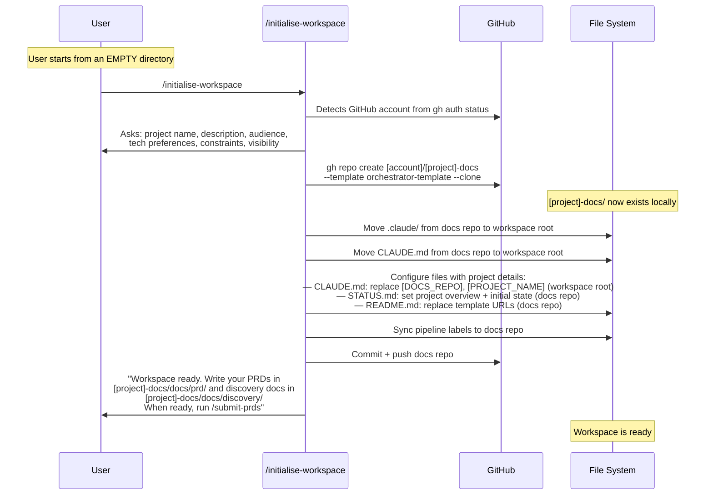

### What the workspace looks like after setup

```
workspace/                        ← user started here
├── .claude/                      ← MOVED from docs repo (tooling, static)
│   ├── agents/                   ← specialist agent definitions
│   ├── skills/                   ← pipeline skills
│   ├── hooks/                    ← session hooks
│   └── rules/                    ← conventions
├── CLAUDE.md                     ← MOVED from docs repo (operating manual, static)
└── [project]-docs/               ← docs repo (git repo — ALL project state lives here)
    ├── STATUS.md                 ← project state (current sprint, blockers, progress)
    ├── repos.yaml                ← repo registry (docs repo only for now)
    ├── active-work/              ← session logs per epic
    ├── docs/
    │   ├── discovery/            ← vision + supporting materials
    │   ├── prd/                  ← PRD documents
    │   ├── architecture/         ← system designs + ADRs (later)
    │   ├── design/               ← UX + impl design (later)
    │   ├── planning/             ← roadmap + epic briefs (later)
    │   └── conventions/          ← shared standards
    ├── templates/                ← issue + PR templates
    └── scripts/                  ← ralph.sh, setup helpers
```

**Why move, not copy?** `.claude/` and `CLAUDE.md` are tooling — they
define how Claude operates. They come from the orchestrator template,
get configured once, and don't change. No duplication, no confusion
about source of truth.

**No AGENTS.md.** Claude Code doesn't natively support the AGENTS.md
open standard. Sub-agents get their instructions from
`.claude/agents/*.md` files, not AGENTS.md. Project memory is handled
through two layers:

- **Project state (shared):** STATUS.md, session logs, docs — git-tracked
  in the docs repo. This is the source of truth.
- **Auto memory (local):** Claude's native `~/.claude/projects/<project>/memory/`
  — machine-local, Claude manages it automatically. Useful but not
  shared. Important learnings should be promoted to CLAUDE.md or
  `docs/conventions/`.

**The docs repo is the project's shared brain.** All project state,
documentation, session history, and cross-agent context lives here.
Agents read it to understand where things are. Agents write to it so
future sessions inherit their knowledge.

No component repos yet — those are created by `/repo-provision` during
the Design phase, after architecture identifies what's needed.

### What the user needs to know

- Run from an empty directory
- Have `gh` CLI authenticated (account is auto-detected)
- Know their project name and a one-paragraph description
- Everything else is asked or handled by the skill

### Key point: global skill

`/initialise-workspace` must be installed globally at
`~/.claude/skills/initialise-workspace/SKILL.md` so it's available
before any project workspace exists. All other skills live in `.claude/`
which doesn't exist until init runs.

---

## Phase 0: Discovery (Manual)

User writes PRDs and vision docs in the IDE with AI help. This is
creative, iterative, potentially days of work. The user is shaping
their product vision — what they're building, why, for whom.

### What goes where

The user needs to know two locations:

| What to write | Where to put it |
|---------------|-----------------|
| Product vision, high-level overview, context, research, competitor notes, user research | `[project]-docs/docs/discovery/` |
| Detailed requirements documents (PRDs) | `[project]-docs/docs/prd/` |

**PRDs** are loosely defined. They don't need to follow a rigid template.
They need enough detail to review and decompose. Could be 1 doc or 20.

**Discovery docs** are supporting materials — vision statement, user
personas, market context, constraints, anything that gives context to
the PRDs.

### What the user does

1. Works in the IDE with AI assistance to write PRDs
2. Iterates as much as needed — this is exploratory
3. Puts files in the right folders
4. When ready to enter the pipeline: runs `/submit-prds`

### What `/submit-prds` does

This is the bridge from manual discovery into the orchestrated pipeline.
The user runs it once to submit their initial PRDs. It handles all the
git/GitHub mechanics.

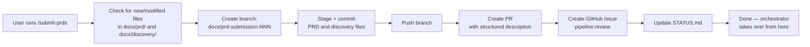

**Re-runnable:** If the user adds more PRDs later (e.g., after review
feedback suggests a new PRD is needed), they can drop new files and run
`/submit-prds` again. It handles the branch/PR mechanics each time.

---

## Terminology: User Engagement Types

Different phases need different types of user interaction. They're not
all the same thing. Naming them properly avoids confusion.

| Type | When | Depth | Agent | Example |
|------|------|-------|-------|---------|
| **Setup** | Workspace init | Light — gather basics, done in minutes | Part of `/initialise-workspace` skill | "What's the project name?" |
| **Facilitation** | PRD review cycle | Deep — reads review context, prior cycles, probes dynamically, makes doc changes | **Stakeholder Facilitator** | "Reviewers found a conflict between PRD-002 and PRD-003. Let's discuss..." |
| **Escalation** | Mid-pipeline | Targeted — specific question, quick answer | **Escalation Agent** (later) | "Design team needs to know: should the API be REST or GraphQL?" |

The **Stakeholder Facilitator** is the main one for Phase 1. It's not
just "asking questions" — it reads the review output, understands
context from prior review cycles, synthesizes findings into a coherent
conversation, makes doc changes in real-time, and pushes everything.

---

## Phase 1: Review Loop

This is where the orchestrator takes over. The review loop has three
actors and cycles between them until the PRDs are clean.

### The three actors

| Actor | Job | When |
|-------|-----|------|
| **Review Team** | Analyse PRDs holistically. Leave PR comments for gaps, conflicts, questions. Fix obvious issues directly. | Autonomous (Ralph session) |
| **Stakeholder Facilitator** | Read review comments + prior context. Walk user through findings. Discuss. Make doc changes based on answers. Push to PR. | Interactive (Ralph session, user engaged) |
| **User** | Answer questions, discuss, make product decisions. | Guided by the facilitator |

### The cycle

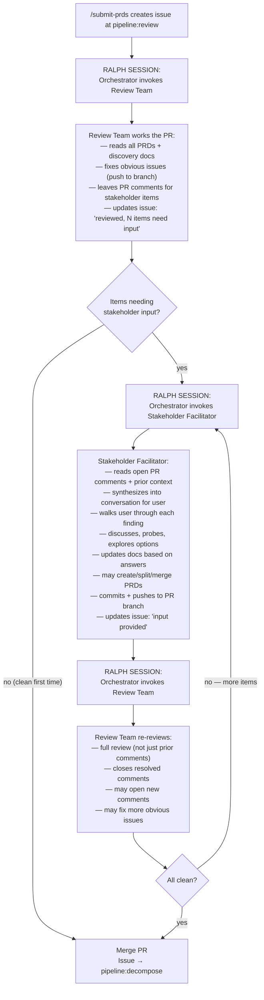

### How the orchestrator decides what to do

The issue stays at `pipeline:review` throughout. The orchestrator reads
the issue comments to understand the sub-state:

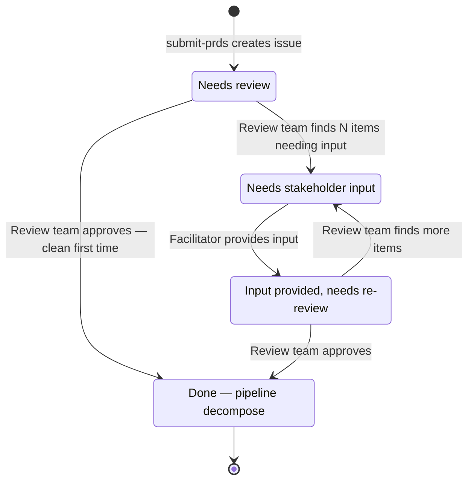

| Orchestrator reads | Dispatches | What happens |
|---|---|---|
| Issue just created, no review yet | Review Team | First review of PRDs |
| "reviewed, N items need stakeholder input" | Stakeholder Facilitator | Guided conversation with user |
| "stakeholder input provided, ready for re-review" | Review Team | Full re-review of updated PR |
| PR approved | (self) | Merge PR, advance issue to pipeline:decompose |

### What the Stakeholder Facilitator does (detail)

The facilitator is the user's interface to the review process. It does
NOT just dump review comments at the user. It:

1. **Reads all open PR review comments** — understands the full picture
2. **Groups and prioritizes** — "there are 3 conflicts, 2 gaps, and
   3 suggestions. Let's start with the conflicts."
3. **Asks clear questions** — translates technical review language into
   stakeholder questions. "The reviewers noticed PRD-002 describes
   real-time sync but PRD-003 assumes batch. Which is your intent?"
4. **Discusses** — if the user is unsure, the agent can explain
   trade-offs, suggest options, probe deeper
5. **Makes changes** — based on user answers, the agent edits the PRD
   files directly. Creates new PRDs if needed. Splits or merges existing
   ones if that's what makes sense.
6. **Pushes everything** — commits all changes to the PR branch and
   pushes. Updates the issue comment.

The user never touches git, PRs, or issues. They just answer questions.

### What the review team does (detail)

The review team are specialist agents (product + technical) who analyse
the PRDs holistically — across ALL documents, not per-document. They:

1. **Read everything** — all PRDs, vision docs, discovery materials
2. **Product review** — completeness, consistency, gaps, scope clarity,
   success criteria, user stories
3. **Technical review** — feasibility, dependencies, implicit
   complexity, integration points, data concerns, scale implications
4. **Fix obvious issues** — formatting, consistency, gaps they can fill
   from context. Push fixes directly to the PR branch.
5. **Leave PR comments** — for things that need stakeholder input.
   Specific, actionable, with suggestions where possible.
6. **Update the issue** — "reviewed, N items need stakeholder input"
   with a summary of what's outstanding.

On re-review:
- Full review, not just checking prior comments
- Close comments that have been properly addressed
- May open new comments based on changes made
- May fix additional obvious issues

### What this phase produces

| Output | Location |
|--------|----------|
| Reviewed, consistent, complete PRDs | `docs/prd/` (merged PR) |
| Vision + supporting docs | `docs/discovery/` (merged PR) |
| Review history | PR comments (closed/resolved) |
| Issue ready for decompose | GitHub Issue at `pipeline:decompose` |

---

## End-to-End: Review

Full walkthrough from PRD submission to approved, merged PRDs.

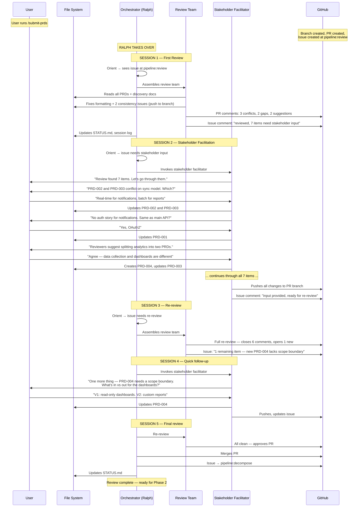

---

## Phase 2: Decompose

After review completes, the approved PRDs need to be grouped into epics
and sequenced into a product roadmap. This is product-level planning —
not implementation-level task breakdown (that happens during Design).

### Inputs

- Approved PRDs in `docs/prd/` (merged from review phase)
- Discovery docs in `docs/discovery/`
- Issue at `pipeline:decompose` (created when review merges)

### Decomposition Team

| Agent | Role | What they contribute |
|-------|------|---------------------|
| project-coordinator (primary) | Process manager | Delegates analysis to PM + architect, produces roadmap from their inputs (process artifact), manages PR review cycle. Never writes technical or product analysis. |
| product-manager | Product analysis + PR review | Product groupings, foundational product epics, initiative themes, PR review |
| architect | Technical analysis + PR review | Foundational design epics, infrastructure epics, dependency constraints, PR review |

The coordinator is the primary agent — a **process manager**, not a
content producer. It invokes PM and architect as sub-agents, takes their
outputs and assembles the roadmap (a process artifact — what epics, in
what order, with what dependencies), and manages the PR review cycle.
All product analysis comes from PM; all technical analysis comes from
architect. The coordinator never writes analysis itself.

### The Flow

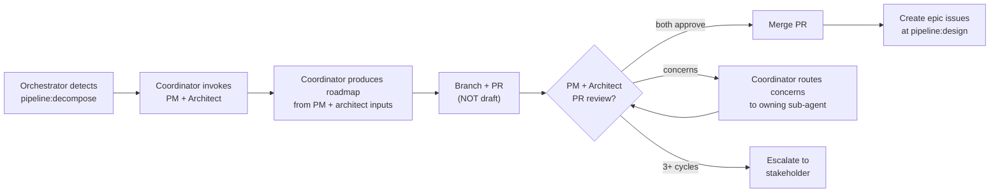

### Sub-State Machine

The issue stays at `pipeline:decompose` throughout. Sub-state tracked
via issue comments:

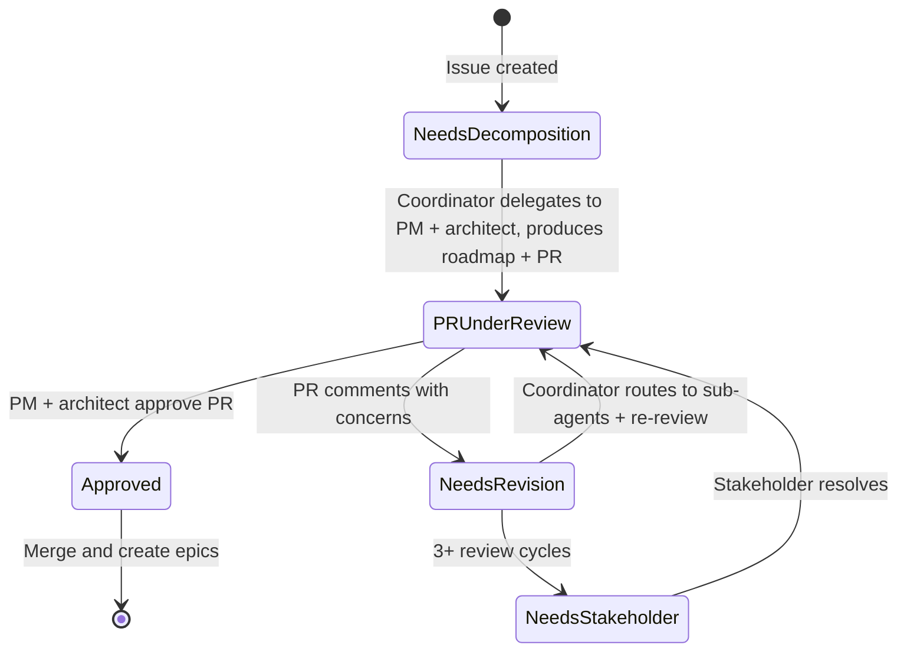

| Orchestrator reads | Sub-state | Action |
|---|---|---|
| No agent comments | Needs decomposition | Dispatch coordinator (full cycle) |
| "decomposition proposed, PR ready for review" | PR under review | PM + architect review the PR |
| "PR reviewed, N concerns" | Needs revision | Coordinator routes concerns to owning sub-agent |
| "PR reviewed, approved" | Approved | Merge PR, create epic issues |
| "escalated to stakeholder" | Needs stakeholder | Ralph stops / user engages |

### PR Review Cycle

PM and architect review the roadmap PR with actual PR comments — the
same traceable mechanism as the review phase. The coordinator routes
each concern to the sub-agent who owns that content (product concerns
to PM, technical concerns to architect), takes revised content back,
updates the branch, and requests re-review. Both PM and architect must
approve the PR for it to merge. This is autonomous — no stakeholder
involvement unless the circuit breaker triggers.

**PM reviews for:**
- Product groupings cover all PRDs (no orphans)
- Priority ordering reflects value delivery
- Initiative labels are meaningful
- Groupings are right-sized (not too large, not too small)
- Foundational product epics are identified where needed

**Architect reviews for:**
- Foundational design epics are complete (data model, auth, API conventions)
- Infrastructure epics are identified
- Dependency ordering is correct
- Complexity risks are flagged

### Foundational Epics (Level 0)

During decomposition, both PM and architect identify foundational epics
that must complete design before feature epics can begin their design
phase. These go at Level 0 in the dependency order.

| Source | Category | Examples |
|--------|----------|----------|
| Architect | Foundational technical design | Holistic data model, auth/identity model, API conventions, event/messaging model |
| Architect | Infrastructure | CI/CD, deployment, monitoring, shared tooling |
| PM | Foundational product design | Persona/role model, core UX model, terminology/naming, cross-cutting product concerns (notifications, search, onboarding) |

### Circuit Breaker

After 3 PR review cycles (PM/architect flag concerns, coordinator routes
to sub-agents for revision, reviewers still have concerns), the coordinator escalates to
the stakeholder:
- Adds `needs-stakeholder-input` label
- Writes a clear summary of unresolved concerns
- Ralph stops; user starts interactive Claude session to resolve

### Initiatives

Initiative labels are thematic groupings applied to epic issues for
context (e.g., `initiative:auth`, `initiative:reporting`). Created
dynamically by the coordinator during decomposition, not pre-defined.
They group related epics across the roadmap.

### What the Roadmap Contains

Template at `docs/planning/templates/roadmap-template.md`:
- **Initiatives** — thematic labels and descriptions
- **Foundational epics (Level 0)** — from both PM and architect, must be
  designed before feature epics (data model, persona model, etc.)
- **Product epics** — grouped from PRDs, with source PRD refs, scope,
  acceptance criteria, dependencies
- **Technical/infrastructure epics** — identified by architect (not from PRDs)
- **Dependency order** — Level 0 first, then sequenced levels noting
  what blocks what
- **Cross-cutting concerns** — things spanning multiple epics

### Epic Issue Creation

On approval, the orchestrator creates epic issues using the epic issue
template. Each epic gets:
- `type:epic` + `pipeline:design` + `initiative:[tag]` labels
- Structured body: overview, source PRDs, scope, acceptance criteria,
  dependencies
- The decompose issue itself is closed with `pipeline:done`

### Outputs

| Output | Location |
|--------|----------|
| Product roadmap | `docs/planning/roadmap.md` (merged PR) |
| Epic issues | Docs repo GitHub Issues at `pipeline:design` |
| Initiative labels | Applied to epic issues |
| STATUS.md update | Current state reflects decomposition results |

### Ralph Integration

Ralph runs the decomposition autonomously. The PR review cycle (PM +
architect reviewing with PR comments, coordinator routing concerns to sub-agents)
happens within the same Ralph session (no user involvement in the
normal case). Only the circuit breaker (3+ review cycles) causes
Ralph to stop.

This is different from the review phase where Ralph always stops for
stakeholder facilitation. Decomposition is mostly autonomous — the team
works, PM and architect review the PR, and epic issues are created
without user intervention.

---

## End-to-End: Decompose

Full walkthrough from approved PRDs to epic issues ready for design.

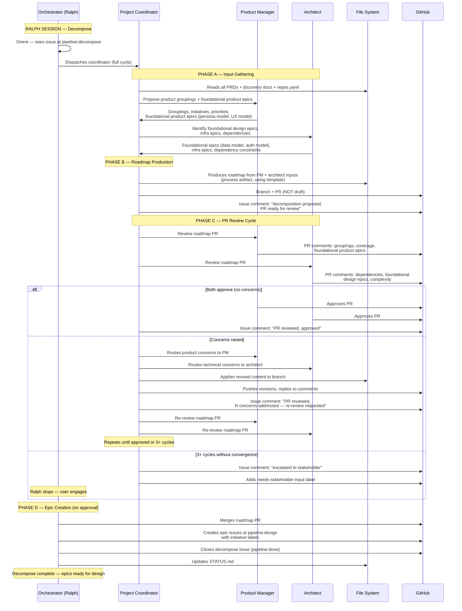

---

## Phase 3: Design (per epic)

After decomposition, each epic at `pipeline:design` needs a full technical
design before implementation begins. Level 0 (foundational) epics are
designed first — their outputs constrain all subsequent designs.

### Inputs

- Epic issue at `pipeline:design` (created during decompose)
- Linked PRDs in `docs/prd/`
- Roadmap in `docs/planning/roadmap.md` (dependency ordering)
- Existing designs in `docs/architecture/` and `docs/design/` (Level 0
  designs and any previously completed epic designs)
- `repos.yaml` — repo topology, stacks, dependencies
- **Existing codebase** — component repos listed in `repos.yaml`. The
  design team must read and understand existing code: patterns,
  conventions, APIs, schemas, dependencies, and technical debt. Designs
  must integrate with reality, not just documents.

### Who Drives Design

The **project-coordinator** drives the Design phase, same as Decompose.
The orchestrator dispatches the coordinator; the coordinator choreographs
the specialist team. This keeps the orchestrator thin — it reads state
and dispatches, while the coordinator manages the multi-agent collaboration.

The coordinator is a **process manager**, not a design producer. All
design content comes from the architect and specialists. The coordinator
collates their outputs (editor, not author), manages the PR/review cycle,
and handles git mechanics. When reviewers raise concerns, the coordinator
routes them back to the sub-agent who owns that content for revision.

```
Orchestrator → dispatches Coordinator
  Coordinator → assesses epic, assembles team
  Coordinator → delegates to Architect (produces design)
  Coordinator → delegates to Specialists (contribute stack-specific design)
  Coordinator → collates outputs, creates PR
  Coordinator → invokes reviewers (architect, spec-compliance, specialists)
  Coordinator → routes review concerns to owning sub-agent, manages cycle
  Coordinator → on approval: merges, decomposes into tasks (with engineer input)
```

### Design Team (dynamic per epic)

The coordinator assembles the team dynamically based on what the epic
touches. Two agents are always present; the rest are determined by the
epic's scope and the stacks in `repos.yaml`.

| Agent | When | Role |
|-------|------|------|
| project-coordinator | Always | Process manager: assembles team, delegates all design to sub-agents, collates outputs, manages PR review cycle, task decomposition (with engineer input on boundaries) |
| architect | Always | Primary design producer: system design, cross-epic consistency, ADRs, integration, codebase patterns |
| spec-compliance | If epic has PRD linkage | PRD coverage (vertical) + cross-document consistency (horizontal) |
| frontend-architect | If epic has UI | Component architecture, state management, performance budgets |
| ux-architect | If epic has UX | User flows, interaction design, accessibility |
| engineer-dotnet | If epic touches .NET repos | .NET design + codebase review |
| engineer-python | If epic touches Python repos | Python design + codebase review |
| engineer-angular | If epic touches Angular/TS repos | Angular/TS design + codebase review |
| engineer-typescript | If epic touches Node/TS repos | Node/TS design + codebase review |
| database-engineer | If epic has data concerns | Schema design, query patterns, migrations |
| devops-engineer | If epic has infra concerns | CI/CD, deployment, monitoring |

Team selection: coordinator reads epic scope → determines repos involved
→ checks `repos.yaml` stack info → selects matching specialists.

**Lightweight path:** Not every epic needs the full team. A Level 0
"API conventions" epic may only need the architect. A small infra epic
may need architect + devops-engineer. The coordinator assesses the epic's
scope and complexity and assembles the minimum viable team. Architect
is always present; spec-compliance is present for any epic that touches
PRD requirements (skippable for pure infrastructure/convention epics
with no PRD linkage).

### Ordering — Level 0 First

- Level 0 (foundational) epics from the roadmap are designed first
- Their outputs (data model doc, auth model doc, API conventions doc,
  UX model doc) become constraints for all subsequent designs
- Feature epics designed in dependency order from the roadmap
- Within a level: epics are independent and *could* parallelize, but
  Ralph runs sequentially (one session = one epic). Parallel design
  would require multiple Ralph instances or manual parallel sessions —
  a future optimisation, not the default.
- If a feature epic design reveals a gap in a Level 0 design →
  backward transition (amendment issue)

### The Flow

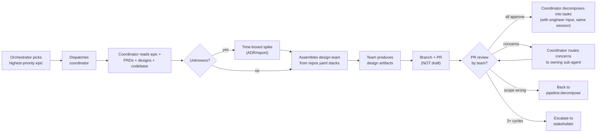

### Design Spikes

Some epics involve genuine uncertainty — technology choices, performance
characteristics, or integration approaches that can't be resolved on
paper. The coordinator can recognise this and call for a **design spike**
before committing to a full design:

- Coordinator assesses epic and identifies specific uncertainties
- Coordinator delegates the spike to the architect (and relevant
  specialists) — they run the investigation, not the coordinator
- Spike is a time-boxed investigation: prototype, benchmark, or proof-of-concept
- Spike produces findings documented as an ADR or spike report
- Findings feed into the full design — the spike resolves unknowns
  before the team commits design effort
- Spike work happens in a throwaway branch (not production code)

This avoids the trap of designing in the abstract when practical
experience is needed. The coordinator decides whether a spike is needed
based on the number and nature of unknowns in the epic, then delegates
the actual investigation to the technical agents.

### Cross-Epic Consistency

Every design must fit into the platform as a whole:

- **Architect is the consistency thread** — present in every design
  review, maintains the holistic view across all epics
- **Spec-compliance checks horizontal consistency** — terminology,
  data model alignment, API convention conformance, UX patterns,
  integration assumptions across all existing designs and docs
- **Every design review explicitly checks:**
  - Conforms to Level 0 foundational designs (data model, API
    conventions, auth model, UX model)
  - Doesn't conflict with other epic designs already merged
  - Shared concerns (logging, error handling, config) are consistent
  - Integration points between epics are compatible
- **Backward transitions**: if a design reveals an inconsistency with
  another design, the coordinator raises an **amendment issue** — a new
  GitHub issue in the docs repo with label `type:amendment`, referencing
  the affected design/PRD and describing the inconsistency. The amendment
  issue enters the pipeline at `pipeline:design` (for design fixes) or
  `pipeline:review` (for PRD fixes) and follows the same PR review cycle.
  This is a lightweight corrective path, not a full re-design.

### Codebase Awareness

Designs must be grounded in the reality of the existing codebase, not
produced in a document vacuum. Whether the project is greenfield,
extending existing systems, or adding features to established code,
the design team must understand what already exists.

- **Read existing code**: architect and specialists read the relevant
  component repos (paths from `repos.yaml`) before designing. Specifically:
  - **Project structure**: directory layout, module organisation
  - **Entry points and routing**: how requests flow through the system
  - **Data models/entities**: existing schemas, relationships, migrations
  - **Service layer**: existing services, their interfaces, dependency injection patterns
  - **API surface**: existing endpoints, contracts, versioning
  - **Auth/authz**: how authentication and authorization are implemented
  - **Config and environment**: how configuration is managed
  - **Test structure**: testing frameworks, fixture patterns, coverage approach
  - **CI/CD**: build scripts, deployment configs, pipeline definitions
  - **Dependency manifests**: package.json, .csproj, requirements.txt — current versions
  The coordinator ensures the team reads the right repos for the epic's scope,
  not the entire codebase. Focus on the layers the epic will touch.
- **Reuse over reinvent**: if a capability already exists in the
  codebase (a utility, a pattern, a service), the design should
  reference and reuse it rather than designing a new one.
- **Compatibility**: new designs must be compatible with existing APIs,
  data schemas, auth flows, and deployment infrastructure. Breaking
  changes require explicit ADRs with migration plans.
- **Pattern consistency**: if the codebase uses repository pattern for
  data access, or a specific error handling convention, or a particular
  testing framework — the design should follow those patterns unless
  there's a documented reason to diverge (ADR).
- **Tech debt awareness**: designs should acknowledge existing tech debt
  that affects the epic's scope. If the design works around debt,
  document it. If it proposes fixing debt, include it in the scope.
- **Dependency alignment**: designs should align with existing framework
  and package versions. Proposing new dependencies requires rationale.
- **Greenfield caveat**: for new projects, earlier Level 0 designs and
  any code produced from them become the "existing codebase" that
  subsequent designs must be aware of.

The specialist agents (engineer-dotnet, engineer-python, etc.) are
particularly valuable here — they bring stack-specific knowledge of
the codebase's existing patterns and conventions.

### PRD Traceability

Every design must trace back to the source PRDs — both the 1000-yard
view (does this fit the product as a whole?) and the detail view (does
this address every requirement?).

- **Design docs explicitly cite PRD requirements**: not just "Source:
  PRD-002" but "this component addresses PRD-002 Section 3.2
  (real-time notifications)" — so a reader can verify coverage
- **Requirements coverage check during review**: spec-compliance agent
  verifies every requirement from the epic's linked PRDs has a design
  answer. No orphaned requirements. No design elements without a PRD
  justification.
- **Cross-document consistency check during review**: spec-compliance
  also verifies terminology, data model alignment, API convention
  conformance, UX pattern consistency, and integration assumptions
  across all existing designs and docs. Flags contradictions between
  this design and any other project artifact.
- **Traceability chain**: PRD → Epic (roadmap) → Design (architecture
  doc) → Tasks (component repo issues). Every link in the chain
  references the one above it.
- **If a design reveals PRD gaps**: coordinator raises an amendment
  issue (label `type:amendment`) targeting the PRD, entering the
  pipeline at `pipeline:review`. Same mechanism as cross-epic
  consistency amendments.

```
PRD-NNN (requirement)
  → EPIC-NNN (groups requirements, references source PRDs)
    → Design doc (addresses each requirement, references PRDs + epic)
      → Task issue (implements part of design, references design doc + epic)
```

### Design Artifacts (per epic)

- Architecture doc in `docs/architecture/[epic-name]/`
  - Must include a **Requirements Traceability** section mapping PRD
    requirements to design elements
- ADRs in `docs/architecture/decisions/` (for significant decisions)
- API contracts (OpenAPI) in `docs/design/api/` if applicable
- Schema designs in `docs/design/schema/` if applicable
- UX specs in `docs/design/ux/` if applicable

**TODO:** Create a design doc template in `docs/planning/templates/`
(similar to `roadmap-template.md`). The template should have sections
for: context/scope, requirements traceability, system design, API
contracts (if applicable), data design (if applicable), cross-epic
integration notes, quality gates, and open questions/ADRs.

### Sub-State Machine

The epic issue stays at `pipeline:design` throughout. Sub-state tracked
via issue comments:

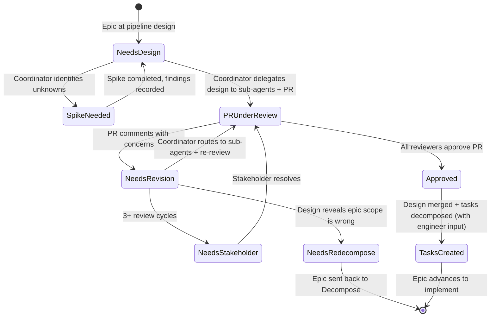

**Backward transitions:** If during design or review the team discovers
the epic's scope is fundamentally wrong — missing concerns, overlapping
with another epic, or needs splitting — the coordinator can send the
epic back to `pipeline:decompose` with a comment explaining why. This
is a safety valve, not a common path. The roadmap would need updating
and re-review. The coordinator adds an issue comment with
`"needs-redecompose: [reason]"` and the orchestrator picks it up.

| Orchestrator reads | Sub-state | Action |
|---|---|---|
| No agent comments | Needs design | Dispatch coordinator to assess + assemble team |
| "spike needed: [unknowns]" | Spike needed | Coordinator delegates spike to architect/specialists |
| "design proposed, PR ready for review" | PR under review | Review team reviews the PR |
| "PR reviewed, N concerns" | Needs revision | Coordinator routes concerns to owning sub-agent |
| "PR reviewed, approved" | Approved | Merge PR, decompose into tasks (with engineer input) |
| "tasks created" | Tasks created | Advance epic, create task issues |
| "escalated to stakeholder" | Needs stakeholder | Ralph stops / user engages |
| "needs-redecompose: [reason]" | Needs re-decompose | Send epic back to `pipeline:decompose` |

### PR Review Cycle

Same mechanism as Review and Decompose phases:

- Design PR created (NOT draft)
- Coordinator requests reviews from the team
- Review team leaves PR comments:
  - **Architect**: architectural quality, cross-epic integration,
    pattern consistency
  - **Spec-compliance**: PRD coverage, cross-document consistency,
    terminology, model alignment
  - **Specialists**: stack-specific technical correctness
- Coordinator routes each concern to the sub-agent who owns that content
  (architecture concerns to architect, stack concerns to relevant
  specialist), takes revised content back, updates the branch
- Re-review until all approve or circuit breaker triggers
- Circuit breaker at 3 review cycles → escalate to stakeholder

### Task Decomposition (within design phase)

After the design PR is approved and merged, the **coordinator** decomposes
the epic into implementation tasks — in the same session, not deferred.
The design session's context (team, codebase understanding, design
decisions) is fresh and valuable; deferring decomposition to a separate
session wastes it.

Task decomposition is **project management**, not design work — the
coordinator owns it. But the coordinator needs technical input on where
the natural task boundaries are in each stack. The coordinator invokes
the relevant **engineer agents** (engineer-dotnet, engineer-angular,
etc. — based on which repos/stacks the design touches) for advice on
task boundaries, then assembles the final task list: sequencing across
repos, resolving cross-repo dependencies, and creating the issues.

For purely architectural epics (no component repos yet), the coordinator
invokes the architect for task boundary advice instead.

Flow: design PR merges → coordinator invokes engineers for task boundary
advice → coordinator assembles task list → task issues created → epic
label advanced to `pipeline:implement`.

- Each task → issue in the appropriate component repo (from `repos.yaml`)
- Tasks reference the design doc and the epic
- Each task has: scope, acceptance criteria, quality gates (from the
  design's quality gates section)
- Shared tasks across epics identified and either:
  - Assigned to the first epic that needs them (dependencies noted)
  - Or tracked as cross-cutting tasks with their own epic reference
- Task issues created at `pipeline:implement`

### Quality Gates

Defined during design by the architect + relevant specialists. Each
epic's design doc must include a quality gates section that specifies
the concrete, measurable criteria for the epic:

**Code quality gates** (enforced by CI and peer engineer during implementation review):
- Test coverage targets (unit %, integration %, e.g. ≥80% unit)
- Linting and static analysis rules (language-specific)
- API contract validation (OpenAPI schema conformance checks)
- Build and compilation (zero warnings policy, or explicit exceptions)

**Non-functional gates** (validated by specialist reviewers during implementation review):
- Performance budgets (response time P95, throughput targets)
- Accessibility requirements (WCAG level, auditing tool)
- Security requirements (auth model, data handling, OWASP checks)
- Browser/platform support (if applicable)

**Design-level gates** (enforced during design PR review):
- Requirements traceability complete (spec-compliance validates)
- Cross-epic consistency verified (architect validates)
- Codebase compatibility confirmed (specialists validate)
- No unresolved open questions

These flow down to task-level acceptance criteria. When the coordinator
decomposes into tasks (with engineer input on task boundaries), each
task inherits the relevant subset of gates. The implementation phase
review cycle enforces all gates — CI handles code quality gates
automatically; specialist reviewers validate non-functional gates
against the design's stated targets.

### Outputs

| Output | Location |
|--------|----------|
| Architecture doc | `docs/architecture/[epic-name]/` (merged PR) |
| ADRs | `docs/architecture/decisions/` |
| Spike reports | `docs/architecture/decisions/` (if spike was run) |
| API contracts | `docs/design/api/` (if applicable) |
| Schema designs | `docs/design/schema/` (if applicable) |
| UX specs | `docs/design/ux/` (if applicable) |
| Task issues | Component repo GitHub Issues at `pipeline:implement` |
| Epic status | Epic issue updated, tasks linked |

### Spec-Compliance: Reviewer, Not Producer

A deliberate design choice: spec-compliance is a **reviewer**, not a
design producer. It does not write design content. It reviews what the
architect and specialists produce and validates:

- **Vertical coverage**: every PRD requirement is addressed somewhere
  in the design (nothing dropped)
- **Horizontal consistency**: terminology, data models, API conventions,
  and UX patterns are consistent across this design and all other
  project documents

This separation of concerns avoids conflating "design the system" with
"check the design covers requirements." The architect makes design
decisions; spec-compliance holds them accountable to the PRD. If
spec-compliance finds gaps, it leaves PR comments — the architect fixes.

### Ralph Integration

Ralph picks up epics at `pipeline:design` in dependency order (Level 0
first, then by roadmap ordering). Each Ralph session: orchestrator
dispatches coordinator, coordinator drives one epic through the full
design cycle. The full cycle — assessment, team assembly, delegating
design production to sub-agents, collating outputs, PR review (routing
concerns to owning sub-agents), task decomposition (with engineer input)
— is autonomous. Circuit breaker for stakeholder escalation.

### End-to-End: Design

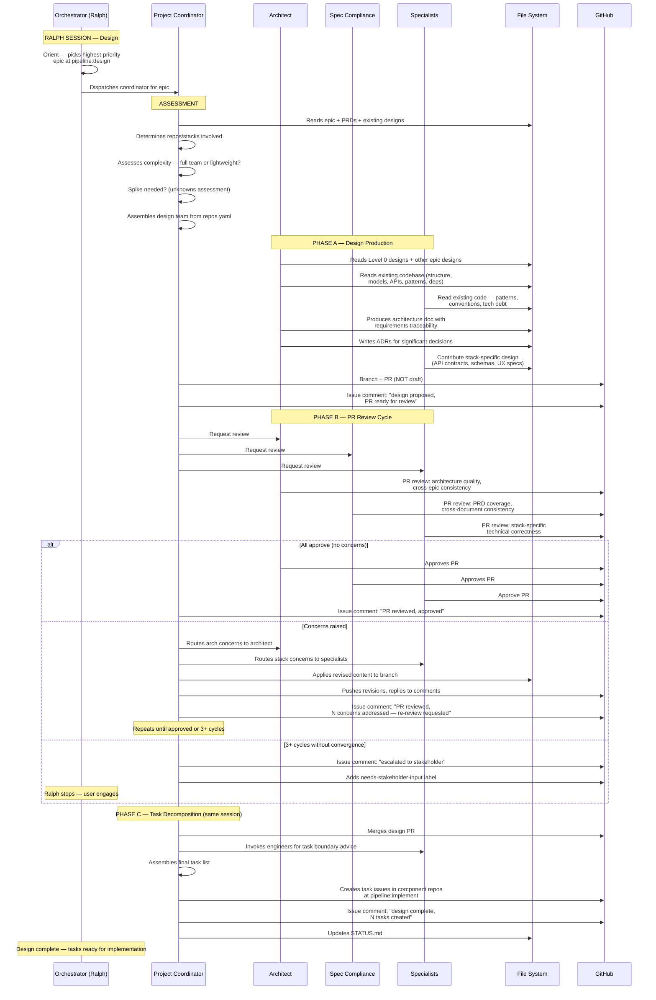

---

## Phase 4: Implement (per task)

After design completes, task issues exist in component repos at
`pipeline:implement`. Each task has scope, acceptance criteria, quality
gates, and references to the design doc and epic. Implementation is
where code gets written — and where it gets reviewed.

Implementation follows the same phase pattern as every other phase:
a **production step** (engineer writes code) and a **review cycle**
(specialist team reviews the PR via PR comments). There is no separate
"verify" phase — review is built into every phase. The task stays at
`pipeline:implement` throughout, with sub-state tracked via issue
comments, consistent with the entire pipeline.

### Inputs

- Task issue at `pipeline:implement` in a component repo (created during
  design phase task decomposition)
- Design doc in `[DOCS_REPO]/docs/architecture/[epic-name]/` (merged)
- Linked PRDs in `[DOCS_REPO]/docs/prd/`
- Epic issue in docs repo (tracking umbrella)
- `repos.yaml` — repo topology, build/test/lint commands, dependencies
- **Existing codebase** — the component repo itself, plus any
  dependency repos. The engineer must understand what exists before
  writing new code.

### Implementation Team (dynamic per task)

Like every other phase, the team is assembled dynamically based on what
the task touches. The coordinator assesses the task scope and selects
the appropriate specialists for both implementation and review.

#### Production: Engineer

One engineer agent implements the task. The engineer type is determined
by the component repo's stack (from `repos.yaml`):

| Repo stack | Engineer agent |
|-----------|---------------|
| .NET / C# | engineer-dotnet |
| Python | engineer-python |
| Angular / TypeScript | engineer-angular |
| Node.js / TypeScript | engineer-typescript |

#### Review: Dynamic Specialist Team

The review team is assembled by the coordinator based on what the task
touches — the same principle as design team assembly. **Whoever
contributed to the design should review the implementation of that
design.** They have the context and can spot drift.

| Task touches | Reviewer | What they check |
|-------------|----------|----------------|
| Any task | engineer-[stack] (peer) | Code quality, stack-specific patterns, test quality, existing codebase consistency, readability |
| API / backend logic | architect | Design conformance, cross-epic integration, pattern consistency with existing codebase, shared concerns |
| UI components | frontend-architect | Component architecture, state management, performance budgets, design system conformance |
| User flows / interaction | ux-architect | Accessibility, interaction patterns, UX consistency, responsive behaviour |
| Database / schema | database-engineer | Query patterns, migrations, indexing, schema conformance with data model |
| Infrastructure / CI | devops-engineer | Deployment configs, environment handling, monitoring, secrets management |
| Any PRD-linked task | spec-compliance | PRD acceptance criteria met, design conformance, traceability |
| Security-sensitive areas | security-reviewer (new) | OWASP, injection, auth, secrets in code, input validation |

**Not every task needs every reviewer.** A small backend bugfix may
only need a peer engineer + architect. A full-stack feature touching
UI, API, and database needs the wider team. The coordinator assesses
and assembles the minimum viable review team — same lightweight path
principle as design.

**The architect is present for any task that touches system integration
points, APIs, or shared concerns** — they are the consistency thread
across the whole project, same role as in design review.

**Spec-compliance is the final gate** — their approval is required
before merge for any task linked to PRD acceptance criteria. They
validate that the implementation actually delivers what the PRD and
design specified.

### Who Drives Implementation

The **project-coordinator** drives the implementation phase at the
epic level, consistent with decompose and design. But the coordinator's
role shifts from "drive each work item" to "dispatch, track, and
integrate":

| Coordinator responsibility | Detail |
|---------------------------|--------|
| **Task readiness** | Check dependency graph — which tasks are unblocked? |
| **Team assembly** | For each ready task: select engineer + assemble review team |
| **Dispatch** | Brief the engineer with full context (task, design, codebase location) |
| **Review coordination** | When engineer's PR is ready, dispatch the review team |
| **Concern routing** | Route review comments to the engineer (or escalate design gaps upstream) |
| **Epic completion** | Track task progress, determine when all tasks for an epic are done |
| **Integration oversight** | When concurrent tasks in the same repo complete, verify they integrate |

Individual task execution is **engineer-led**, not coordinator-led. The
engineer owns the implementation session. The coordinator dispatches,
then re-engages when the PR is ready for review or when the task
completes.

### The Flow

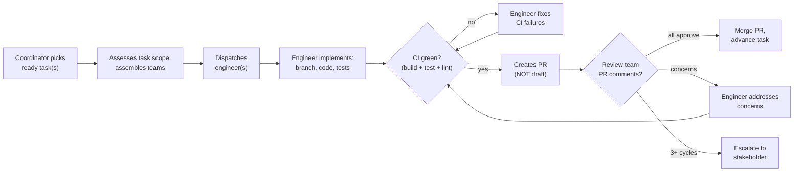

### CI as a Hard Gate

CI must pass before the review cycle begins. This is non-negotiable:

- **Build** — the code compiles / bundles without errors or warnings
- **Tests** — all unit and integration tests pass
- **Lint / format** — code meets project formatting and lint standards
- **Type checks** — where applicable (TypeScript strict mode, mypy, etc.)

The engineer runs these locally before creating the PR. CI runs again
on the PR. If CI fails on the PR, the review team does not begin —
the engineer fixes CI first. This prevents wasting reviewer time on
code that doesn't build or pass tests.

After addressing review concerns, CI must pass again before re-review.
Every round-trip through the review cycle includes a CI gate.

Build, test, and lint commands come from `repos.yaml` — each component
repo declares its commands so agents don't guess.

### Sub-State Machine

The task issue stays at `pipeline:implement` throughout. Sub-state
tracked via issue comments, consistent with all other phases:

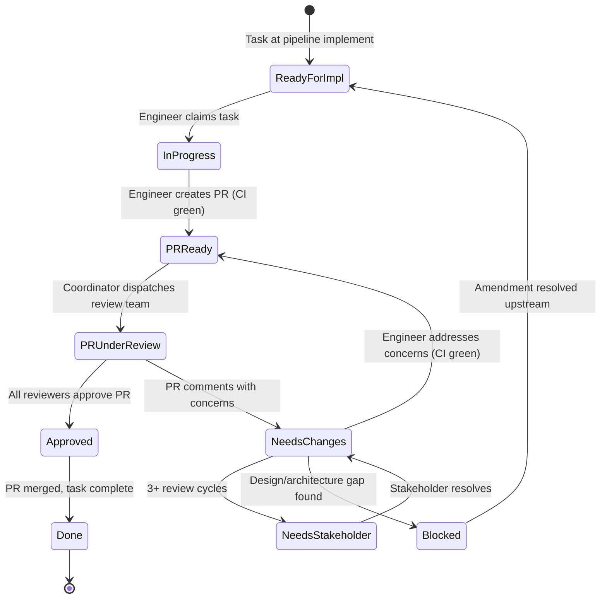

| Orchestrator reads | Sub-state | Action |
|---|---|---|
| No agent comments (task just created) | Ready for implementation | Coordinator dispatches engineer |
| "claimed by [session]" | In progress | Skip — engineer is working |
| "implementation complete, PR ready for review" | PR ready | Coordinator assembles + dispatches review team |
| "PR under review" | PR under review | Wait for reviewers |
| "PR reviewed, N concerns raised" | Needs changes | Engineer addresses concerns |
| "PR reviewed, N concerns addressed — re-review requested" | PR ready (re-review) | Coordinator re-dispatches review team |
| "PR reviewed, approved" | Approved | Merge PR, advance task |
| "escalated to stakeholder" | Needs stakeholder | Stop for user engagement |
| "blocked: amendment #NNN" | Blocked | Skip until amendment resolved |

### Engineer Behaviour (Production Step)

When dispatched to a task, the engineer:

1. **Reads context** — task issue, linked design doc, linked PRDs,
   epic issue, quality gates
2. **Reads existing codebase** — the component repo's current state.
   Understands project structure, existing patterns, conventions,
   dependencies, test structure. Does not code in a vacuum.
3. **Creates feature branch** — `feat/[issue-number]-[short-description]`
   from latest `main`
4. **Implements** — follows the design doc, uses existing patterns and
   conventions, writes clean code that integrates with what exists
5. **Writes tests** — unit tests for business logic, integration tests
   for API endpoints / data access. Coverage must meet the quality gates
   defined in the design doc.
6. **Runs CI locally** — build, test, lint, format. All must pass.
7. **Creates PR** — NOT draft. Ready for review. PR body includes:
   - What changed and why
   - References: task issue, epic, design doc
   - How to verify / test
   - Any decisions made during implementation (with rationale)
8. **Updates task issue** — comment: "implementation complete, PR #NNN
   ready for review"

**What the engineer does NOT do:**

- Does not merge their own PR (review team approves, coordinator merges)
- Does not advance pipeline labels (coordinator does)
- Does not guess when the design is ambiguous — creates an amendment
  issue (backward transition)
- Does not introduce patterns inconsistent with the existing codebase
  without an ADR

### PR Review Cycle

Same mechanism as every other phase. The coordinator assembles the
review team, dispatches reviewers, routes concerns, manages the cycle.

**Step 1: Coordinator assembles review team**

Based on the task scope (what files/layers/concerns it touches), the
coordinator selects reviewers from the dynamic specialist team table
above. The coordinator reads the PR to understand what was changed and
determines which specialists are needed.

**Step 2: Dispatch reviewers (parallel where independent)**

Each reviewer reads the PR diff and the existing codebase context:

- **Peer engineer** (always present): code quality, stack patterns,
  test quality, naming, readability, existing pattern consistency.
  Reviews as a senior engineer doing a thorough code review.
- **Architect** (when applicable): design conformance — does the
  implementation match the architecture doc? Cross-epic integration
  — do APIs, data models, and shared concerns align with other
  implementations? Pattern consistency — does this follow established
  codebase patterns or diverge without justification?
- **Frontend-architect** (when UI): component architecture, state
  management patterns, performance budgets, design system conformance,
  rendering efficiency, bundle impact.
- **UX-architect** (when user-facing): accessibility compliance,
  interaction pattern consistency, responsive behaviour, UX flow
  conformance with the UX spec.
- **Database-engineer** (when data): query efficiency, migration
  safety, index strategy, schema conformance with the data model
  design. Checks for N+1 queries, missing indexes, unsafe migrations.
- **DevOps-engineer** (when infra): deployment config correctness,
  environment variable handling, monitoring/logging, CI pipeline
  compatibility.
- **Security-reviewer** (when security-sensitive): OWASP top 10,
  injection vectors, authentication/authorization correctness,
  secrets handling, input validation. Every PR that touches auth,
  user input, or external integrations should include security review.
- **Spec-compliance** (final gate): acceptance criteria from PRD met,
  design doc requirements addressed, quality gates satisfied. This is
  the traceability check — does the code actually deliver what was
  specified?

**Step 3: Reviewers leave PR comments**

Each reviewer leaves specific, actionable PR comments. Comments must
reference the standard they're checking against (design doc section,
PRD criterion, codebase pattern, security rule) — not just "this
looks wrong."

**Step 4: Coordinator routes concerns to engineer**

The coordinator collates review feedback and routes it to the
implementation engineer:

- "PR comments from [reviewer]: [summary of concerns]"
- "Address these concerns, push to the PR branch, and confirm when ready
  for re-review."

The engineer addresses concerns, ensures CI passes again, pushes to the
branch, and updates the task issue: "PR reviewed, N concerns addressed
— re-review requested."

**Step 5: Re-review**

The coordinator re-dispatches the review team (or the subset whose
concerns were addressed). Repeat until all reviewers approve or the
circuit breaker triggers.

**Step 6: On approval**

When all required reviewers approve:

- Coordinator merges the PR: `gh pr merge --squash --delete-branch`
- Coordinator updates the task issue: "PR reviewed, approved. PR merged."
- Task issue closed or labelled `pipeline:done`
- Coordinator checks: are all tasks for this epic now complete?

### Circuit Breaker

Same pattern as all other phases. After 3 review cycles without all
reviewers approving, the coordinator escalates:

- Adds `needs-stakeholder-input` label to the task issue
- Writes a summary of unresolved concerns
- Engineer stops work on this task, moves to other unblocked tasks
- User engages to resolve the impasse

### Backward Transitions (Amendment Issues)

When implementation reveals gaps in upstream documents, the engineer
does NOT guess or make assumptions. This is the same escalation
mechanism used across all phases:

**Design/architecture gaps** — missing API contracts, unclear data
models, unspecified cross-service behaviour, design that doesn't work
in practice:

```bash
cd [DOCS_REPO]
gh issue create --title "Amendment: architecture [specific gap]" \
  --label "type:amendment,pipeline:design,blocker" \
  --body "Blocks [component-repo]#[task-issue].
Implementation found: [specific gap].
Design doc: docs/architecture/[epic-name]/"
cd ..
```

**PRD gaps** — ambiguous acceptance criteria, contradictory
requirements, missing edge cases:

```bash
cd [DOCS_REPO]
gh issue create --title "Amendment: PRD-NNN [specific gap]" \
  --label "type:amendment,pipeline:review,blocker" \
  --body "Blocks [component-repo]#[task-issue].
Implementation found: [specific gap]."
cd ..
```

**UX/design gaps** — missing interaction states, unclear component
behaviour, unspecified error flows:

```bash
cd [DOCS_REPO]
gh issue create --title "Amendment: UX spec [specific gap]" \
  --label "type:amendment,pipeline:design,blocker" \
  --body "Blocks [component-repo]#[task-issue].
Implementation found: [specific gap]."
cd ..
```

After creating any amendment:
1. Add `blocked` label to the component task issue
2. Update task issue comment: "blocked: amendment #NNN"
3. Move to other unblocked tasks

When the amendment is resolved upstream (PR merged), the `blocked`
label is removed and the task re-enters the ready pool.

### Concurrency Model

Implementation is where parallelism becomes critical. Multiple tasks
can — and should — be worked concurrently. The concurrency model must
prevent conflicts while maximising throughput.

#### Execution Model: Multiple Claude Sessions

Implementation does not initially use Ralph. Instead, the user opens
multiple Claude terminal sessions, each picking up an implementation
task. This is closer to how a real dev team operates — multiple
engineers working concurrently, coordinated through the issue board
and PR process.

Each session:
1. Coordinator (or orchestrator) identifies ready tasks
2. Session claims a task (adds `claimed:[session-id]` label)
3. Engineer implements in that session
4. PR created, review dispatched within the session
5. On completion, claim label removed

#### Dependency-Aware Scheduling

Not all tasks can run concurrently. The task decomposition during
design phase established a dependency graph. The coordinator respects
this:

- Tasks with no dependencies → immediately available
- Tasks depending on other tasks → available only when dependencies
  are at `pipeline:done`
- Cross-repo dependencies (e.g., shared library must be published
  before consumer repo can use it) → enforced via dependency ordering

The coordinator checks the dependency graph before dispatching any
task. It will not dispatch a task whose dependencies are incomplete.

#### Conflict Prevention

| Strategy | What it prevents |
|----------|-----------------|
| **Claimed labels** | Two sessions grabbing the same task |
| **Cross-repo partitioning** | Tasks in different repos have zero file conflict risk |
| **Task boundary discipline** | Design phase decomposition creates tasks that touch distinct modules/layers within a repo |
| **Branch-per-task** | Each task works on its own feature branch from `main` |
| **Rebase before merge** | When a task's PR is ready to merge, rebase onto latest `main` to incorporate other merged work |

#### Same-Repo Concurrent Tasks

When multiple tasks target the same component repo, the risk of
merge conflicts increases. Mitigation:

1. **Good task boundaries** — the design phase should decompose into
   tasks that touch distinct files/modules. The engineer agents
   advise on this during task decomposition.
2. **Frequent rebasing** — engineers rebase onto `main` regularly
   during implementation (at minimum before creating PR, and before
   re-review after addressing comments).
3. **Small, focused PRs** — one task = one PR. Not batching.
4. **Merge order follows dependency order** — tasks that produce
   interfaces/contracts merge before tasks that consume them.
5. **Conflict resolution** — if a rebase produces conflicts, the
   engineer resolves them. If conflicts are extensive (signals poor
   task boundary design), the coordinator flags this to the architect
   as potential task decomposition feedback for future epics.

#### Integration Verification

When tasks within the same epic or same repo complete and merge:

- The coordinator verifies the merged `main` still builds and passes
  tests (CI should catch this, but the coordinator confirms)
- If integration issues surface post-merge, the coordinator creates a
  follow-up task to resolve them
- For cross-repo integration (e.g., API provider + consumer), the
  coordinator sequences: provider merges first, consumer rebases and
  verifies against the new provider

### Epic Completion

When all tasks for an epic reach `pipeline:done`:

1. Coordinator verifies all tasks are complete and merged
2. Coordinator runs a final integration check — does everything work
   together? (build + test across all affected repos)
3. Coordinator updates the epic issue in the docs repo:
   "All tasks complete. Implementation done."
4. Epic advances to `pipeline:deliver`
5. STATUS.md updated

If the final integration check reveals issues, the coordinator creates
targeted fix tasks in the relevant component repos at
`pipeline:implement` and the cycle continues.

### Outputs

| Output | Location |
|--------|----------|
| Implemented code | Component repo `main` (merged PRs) |
| Tests | Component repo (alongside code) |
| PR review history | Component repo PR comments |
| Task completion | Component repo issues at `pipeline:done` |
| Epic status | Docs repo epic issue updated |
| STATUS.md | Updated with implementation progress |

### Orchestrator Integration

The orchestrator handles `pipeline:implement` task issues. When it
detects tasks at this stage:

1. **Orient** — read all task issues across component repos (from
   `repos.yaml`), check dependency graph, identify ready tasks
2. **Decide** — which tasks are ready (dependencies met, not claimed,
   not blocked)?
3. **Execute** — dispatch coordinator to assemble team and brief
   engineer for each ready task. In concurrent mode, multiple tasks
   can be dispatched to separate sessions.
4. **Update** — STATUS.md, epic progress, task states

| What orchestrator sees | Sub-state | Action |
|---|---|---|
| Task with no agent comments, unclaimed | Ready | Dispatch coordinator → engineer |
| Task claimed by a session | In progress | Skip |
| "implementation complete, PR ready for review" | PR ready | Dispatch coordinator → review team |
| "PR reviewed, approved" | Approved | Merge, advance task |
| "blocked: amendment #NNN" | Blocked | Skip until amendment resolved |
| `needs-stakeholder-input` label | Waiting | Stop (autonomous) or engage user (interactive) |
| All tasks for epic at `pipeline:done` | Epic complete | Coordinator runs integration check, advances epic |

### End-to-End: Implement

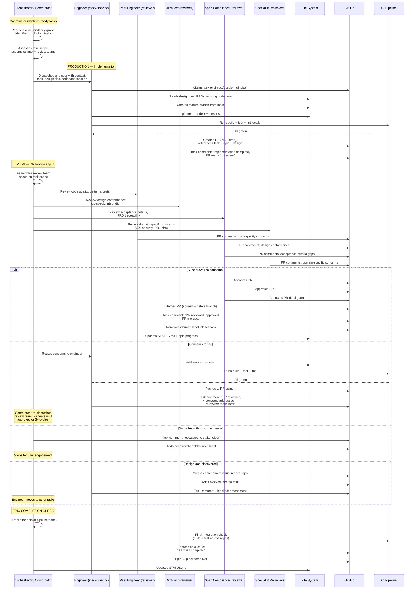

---

## Known Gap: Design Phase Specialist Review Coverage

> Observed during testing: the design phase coordinator tends to
> assemble a minimal team (architect + PM) for review, under-utilising
> specialist reviewers (frontend-architect, ux-architect, database-engineer,
> etc.) even when the epic clearly touches those domains.
>
> **Root cause:** The coordinator agent's assessment step doesn't
> consistently map epic scope to specialist involvement. It defaults to
> architect-only review for most epics.
>
> **Impact:** Designs that lack specialist review may have gaps that
> surface during implementation — causing avoidable backward transitions.
>
> **Fix needed:** Strengthen the coordinator's team assembly logic
> during the design phase. The coordinator must read `repos.yaml` stack
> info and the epic's scope to determine which specialists are needed,
> not just default to architect. This applies to both design production
> and design PR review. The same dynamic team assembly principle
> documented for the implement phase review team should be applied
> retroactively to the design phase.
>
> This is a coordinator agent behaviour fix, not a pipeline design change.

---

## Notes for Later Phases

> Rough notes. Each phase gets detailed treatment when we get to it.

### Phase 5: Deliver (per epic)
- All tasks for the epic complete and merged
- E2E testing across the full epic scope
- Documentation updates (API docs, user guides, runbooks)
- Release preparation (versioning, changelog, tagging)
- Deployment coordination (staging → production)
- Stakeholder sign-off before production release

### Cross-cutting
- Orchestrator loop: orient → decide → work → update
- Issues are the only driver
- PRs are the mechanism
- PR comment review cycles at every phase
- File system = shared state
- Backward transitions when downstream finds problems

---

## Decisions Made

| Decision | Why |
|----------|-----|
| `/initialise-workspace` is a global skill | Must exist before project workspace |
| `/adapt-project` runs during init | Configure once, don't repeat |
| Move `.claude/` + `CLAUDE.md`, don't copy | Tooling is static — no duplication, no source-of-truth confusion |
| No AGENTS.md | Claude Code doesn't support it natively. Sub-agents use `.claude/agents/*.md` |
| Auto memory is machine-local (accepted for V1) | Claude's native memory system. Important learnings promoted to shared state |
| Docs repo is the shared brain | All project state, cross-agent context, session logs |
| No component repos at init time | Created during Design after architecture |
| Discovery is manual in IDE | Creative, iterative, human judgment |
| User drops files into specific folders | `docs/prd/` and `docs/discovery/` |
| `/submit-prds` handles all mechanics | User doesn't touch git, PRs, issues |
| `/submit-prds` is re-runnable | Can add/update PRDs later |
| Review Team ≠ Stakeholder Facilitator | Analysis vs. guided conversation — different skills |
| Facilitator walks user through findings | User discusses and decides, facilitator does mechanics |
| Review Team fixes obvious issues directly | Only escalate genuine stakeholder decisions |
| Issue comments track sub-state | Orchestrator reads latest to decide next action |
| PR comments are the tangible feedback | Close as resolved, shows progress |
| One issue through the whole review cycle | No proliferation |
| GitHub account auto-detected | `gh auth status` — don't ask the user |
| Init asks enriching questions (description, audience, constraints) | Seeds every file with useful context from day one |
| "Facilitator" not "Interviewer" for PRD review engagement | Facilitator mediates, synthesizes, acts — different from light setup Q&A |
| Different user engagement types get different names | Setup ≠ Facilitation ≠ Escalation — avoids ambiguity as pipeline grows |
| Decompose team = coordinator + PM + architect | Product grouping needs product perspective, technical epics need architect, coordinator produces roadmap from their inputs (process artifact) |
| PM signs off on decomposition (not stakeholder) | Decomposition is a product-level planning activity; PM is the authority unless major concerns |
| Circuit breaker at 3 revision cycles | Same pattern as review loop guard — prevents infinite internal disagreement loops |
| Coordinator is process manager for decompose | Coordinator drives the process, delegates all analysis to PM and architect, owns the roadmap as a process artifact |
| Technical epics identified during decompose | Architect identifies infrastructure/auth/shared-lib epics not in PRDs — these are real work that needs planning |
| Initiative labels are dynamic | Created by coordinator during decomposition, not pre-defined — keeps things flexible |
| Unified orchestrator handles multiple stages | Single `/orchestrate` skill reads pipeline label and dispatches to correct logic; ralph.sh stays simple |
| Decompose is mostly autonomous (no stakeholder unless circuit breaker) | Different from review where stakeholder always engages; PM can sign off without user involvement |
| Decompose uses PR review comments (same as review phase) for sign-off | Consistent mechanism across pipeline, traceable review trail via PR comments |
| Foundational epics (Level 0) identified during decompose by both PM and architect | Data model, auth model, persona model, etc. must be designed before feature epics |
| Design team is dynamic per epic — architect + spec-compliance always present | Specialists assembled from repos.yaml stack info; right experts for the right epic |
| Level 0 foundational epics designed first | Their outputs (data model, auth model, API conventions, UX model) constrain all subsequent designs |
| Cross-epic consistency enforced by architect + spec-compliance | Architect checks architectural integration; spec-compliance checks document/terminology/model consistency |
| Spec-compliance in design review — vertical + horizontal | Vertical: PRD requirements coverage. Horizontal: cross-document consistency (terminology, models, conventions) |
| Task decomposition happens during Design phase | Coordinator breaks epics into repo-specific tasks (with engineer input on boundaries) after design is approved |
| Quality gates defined per-epic during design | Test coverage, API validation, performance budgets, accessibility — flow down to task acceptance criteria |
| Design uses same PR review + comment cycle as Review and Decompose | Consistent mechanism across all pipeline phases |
| Full PRD traceability enforced in design | Design docs cite specific PRD requirements; review includes coverage check; chain: PRD → Epic → Design → Task |
| Designs must be codebase-aware | Team reads existing code before designing — reuse over reinvent, pattern consistency, compatibility with existing APIs/schemas, tech debt awareness |
| Coordinator drives Design phase as process manager (same as Decompose) | Keeps orchestrator thin; coordinator delegates all design to sub-agents, collates outputs, manages review cycle. Never writes design content. |
| Spec-compliance is a reviewer, not a design producer | Separation of concerns — architect designs, spec-compliance validates against PRDs and cross-document consistency |
| Lightweight path for simpler epics | Not every epic needs the full team; coordinator assesses and assembles minimum viable team |
| Task decomposition in same session as design | Design session's context is fresh; deferring wastes it |
| Design doc template needed | Standardises design artifacts like roadmap template standardises decompose output |
| Design spikes for uncertain epics | Time-boxed investigations before committing design effort; avoids designing in the abstract |
| Backward transition from Design → Decompose | Safety valve when design reveals epic scope is wrong; coordinator sends back with explanation |
| Specific codebase reading guidance | Coordinator ensures team reads the right layers — not "read everything" but targeted reading of structure, models, APIs, patterns |
| Quality gates structured into categories | Code quality (CI), non-functional (verify), design-level (review) — each with measurable criteria |
| Sequential design via Ralph (parallelization deferred) | Ralph runs one session at a time; parallel design is a future optimisation |
| Implement and review are ONE phase, not two | Every phase has a production step + review cycle built in. Splitting implement/verify breaks the consistent pipeline pattern. |
| Review team is dynamic per task (same as design team assembly) | Whoever contributed to the design should review the implementation. Coordinator assesses task scope and assembles minimum viable review team. |
| CI is a hard gate before review begins | Build + test + lint must pass before reviewers engage. Prevents wasting reviewer time on broken code. |
| Spec-compliance is the final merge gate for implementation | They validate the code delivers what the PRD and design specified — the traceability check. |
| Architect reviews implementation for cross-epic consistency | Same role as in design review — the consistency thread. Catches drift between implementation and design, and between implementations. |
| Frontend-architect and ux-architect review UI/UX implementations | Specialist reviewers check their domain: component architecture, accessibility, interaction patterns, design system conformance. Addresses the gap observed in design phase testing. |
| Multiple Claude sessions for implementation concurrency (not Ralph initially) | User opens N terminals, each claiming a task. Closer to real team operation. Ralph can be added later as the autonomous loop for implementation. |
| Dependency-aware scheduling from task decomposition graph | Coordinator checks dependency graph before dispatching. Tasks with unmet dependencies are not available. Prevents integration failures from out-of-order implementation. |
| Claimed labels prevent concurrent task conflicts | Same mechanism as Ralph's session claiming, but used across interactive sessions. Lightweight, GitHub-native coordination. |
| Same-repo concurrency relies on good task boundaries + rebasing | Design phase task decomposition should create tasks touching distinct modules. Engineers rebase frequently. Extensive conflicts signal poor task boundary design. |
| Coordinator role shifts to dispatch + track + integrate during implementation | Individual tasks are engineer-led. Coordinator dispatches, assembles review teams, tracks epic completion, and verifies integration. Not driving each work item like in design. |
| Epic completion includes final integration check | Coordinator verifies all tasks merged, all repos build and pass tests together. Creates fix tasks if integration issues found. |
| Security-reviewer agent needed for implementation phase | OWASP, injection, auth, secrets, input validation. Every PR touching auth/user input/external integrations should include security review. |
| Design phase specialist review gap identified | Coordinator defaults to architect-only review. Needs fix: coordinator must map epic scope to specialist involvement for both design production and PR review. |

---

## Open Questions

| # | Question | Context |
|---|----------|---------|
| 1 | Should init and adapt be one skill or two? | Currently drafted as separate — may simplify to one |
| 2 | What makes a PRD "good enough" for initial submission? | User needs some guidance without imposing a rigid template |
| 3 | How does the facilitator handle a user who disagrees with all review findings? | Edge case — need a graceful "override" path |
| 4 | ~~What happens if review cycles exceed N iterations?~~ | **Answered:** Circuit breaker at 3 cycles → escalate to stakeholder |
| 5 | Later phases will need more engagement types — what do we call design review facilitation? | May be same Stakeholder Facilitator with different context, or may warrant a new type |
| 6 | Should `/submit-prds` create one issue per submission or reuse existing? | First run = create. Re-run after facilitator adds PRDs = same issue? new? |
| 7 | What if `gh auth status` fails at init? | Need to fail fast with clear guidance |
| 8 | What if workspace directory isn't empty? | Guard? Overwrite? Bail? |
| 9 | Re-running `/initialise-workspace` — idempotent or error? | Accidental re-run, or trying to reset |
| 10 | Where does the orchestrator template live on GitHub? | Needs a known, stable location for `--template` |
| 11 | What does `repos.yaml` look like after init? | Template placeholder? Auto-populated with docs repo entry? |
| 12 | Auto memory promotion mechanism — how and when? | V1: manual or orchestrator promotes. V2: might need sync to docs repo |
| 13 | Do sub-agents need shared project context beyond their agent file? | Orchestrator passes context when spawning — is that sufficient? |
| 14 | Security-reviewer agent — new agent or role within existing agents? | Could be a dedicated `.claude/agents/security-reviewer.md` or a review mode on engineer agents. Dedicated agent is cleaner but adds another agent to maintain. |
| 15 | How does the coordinator discover task dependencies across component repos? | Task issues reference dependencies, but the coordinator needs to read issues across multiple repos. `repos.yaml` has repo list, but cross-repo issue querying is verbose with `gh`. |
| 16 | Should implementation sessions use Ralph or be purely interactive? | Initial design says interactive (multiple terminals). Ralph with `--stage implement` could work too. May evolve — start interactive, add Ralph later. |
| 17 | How does the coordinator know which specialists to include in implementation review? | Task issues should carry metadata about what they touch (UI, API, DB, etc.) from design phase decomposition. Or coordinator reads the PR diff and infers. Former is more reliable. |
| 18 | What does `repos.yaml` need to include for implementation? | Currently has repo paths, stacks, dependencies. May also need: build commands, test commands, lint commands, so engineers and CI know what to run. |
| 19 | How are concurrent sessions coordinated in practice? | User opens terminals manually. Should there be a script (like ralph.sh) that opens N sessions? Or is manual sufficient for V1? |
| 20 | Peer engineer review — same agent type or different instance? | Engineer-dotnet reviewing another engineer-dotnet's work. Same agent definition, different invocation. Need to ensure the reviewer has fresh context, not the implementer's bias. |
